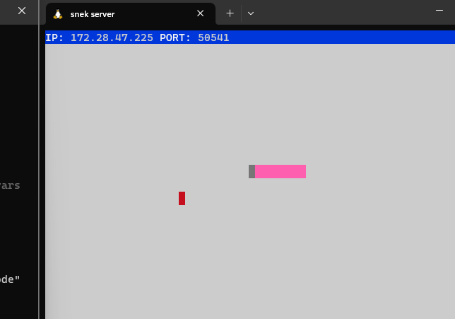

# Snake Client Project

Snake game is a very popular video game. The game concept is simple. The player (snake) slithers around and grows by 'eating' pieces of food. As it moves and eats, it grows and eventually becomes an obstacle to itself. The goal is to grow as large as possible without hitting its own self or the side walls. If either event should happen, it would die.

This is simply a multiplayer take on the genre.

To run this client, a server side will also need to be running which can be downloaded and installed from here.

## Screenshot of game in action!

## Getting Started
### Instructions

- Follow steps inside the snek server repo to run the server side
- Run the development snake client using the `node play.js` command.
- Use WASD keys to move snake around up, down, left, right.
- use keys t,y,u,i to send messages when playing with others
- Press CTRL + C when ready to quit game
- Enjoy!

##Credit

This game was inspired by Snek, originally created by Tania Rascia. It is a remix of the original version from Tania Rascia.